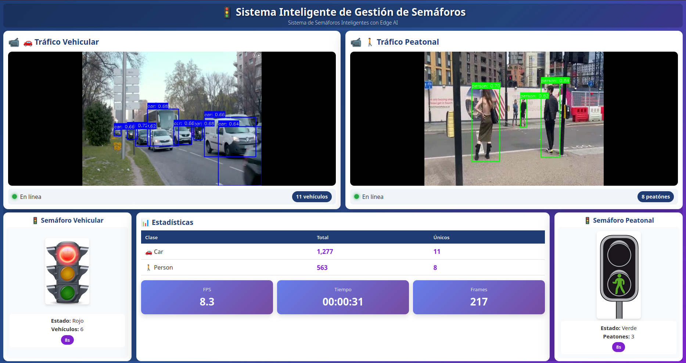

# FlowZen - Sistema Inteligente de Control de Semáforos
**EL-5841 Taller de Sistemas Embebidos | Grupo 1**

<div align="center">



*Sistema de control de tráfico adaptativo con Computer Vision y Machine Learning*

<p>
  <a href="https://www.raspberrypi.com/"></a>
  <a href="https://www.yoctoproject.org/"></a>
  <a href="https://www.tensorflow.org/lite"></a>
  <a href="https://www.python.org/"></a>
  <a href="https://www.tec.ac.cr"></a>
</p>

</div>

---

## Descripción del Proyecto

Sistema embebido de control de tráfico adaptativo implementado en **Raspberry Pi 5** utilizando **Computer Vision** y **Machine Learning** para optimizar el flujo vehicular en intersecciones mediante detección en vivo de vehículos y peatones.

---

## Estado del Proyecto

- ✅ Pipeline de procesamiento completo (8 módulos)
- ✅ Sistema operativo Yocto personalizado
- ✅ Control adaptativo de semáforos operativo
- ✅ Dashboard web con streaming HLS dual
- ✅ Detección y tracking con TensorFlow Lite

---

## 📚 Tabla de Contenidos

- [Descripción del Proyecto](#descripción-del-proyecto)
- [Estado del Proyecto](#estado-del-proyecto)
- [Componentes de Hardware](#componentes-de-hardware)
- [Stack de Software](#stack-de-software)
- [Pipeline de Procesamiento](#pipeline-de-procesamiento)
- [Sistema Operativo Yocto](#sistema-operativo-yocto)
- [Instalación y Uso](#instalación-y-uso)
- [Estructura del Repositorio](#estructura-del-repositorio)
- [Equipo de Desarrollo](#equipo-de-desarrollo)

---

## Descripción General

FlowZen es un sistema diseñado para el control inteligente de semáforos en intersecciones urbanas. A diferencia de los sistemas tradicionales con tiempos fijos, FlowZen utiliza **visión por computadora** para detectar vehículos y peatones en tiempo real, ajustando dinámicamente los tiempos de luz verde y roja según la demanda actual de tráfico.

El sistema está implementado sobre **Raspberry Pi 5** con un sistema operativo personalizado basado en **Yocto Project**, optimizado específicamente para tareas de Computer Vision y Machine Learning en edge computing.

---

## Componentes de Hardware

### Plataforma Principal

- **Raspberry Pi 5** (4GB RAM)
- **Módulo de Cámara Raspberry Pi** Camera Module 3
- **Tarjeta microSD** 32GB 
- **Fuente de alimentación** USB-C 5V/5A 

### Periféricos

- Monitor HDMI (para desarrollo y depuración)
- Conectividad de red (Ethernet o WiFi)

---

## Stack de Software

### Sistema Operativo

> **Raspberry Pi OS personalizado con Yocto Project**
>
> El sistema operativo fue construido desde cero utilizando Yocto Project, permitiendo control total sobre los componentes del sistema y optimización para la aplicación específica.

**Capas de Yocto utilizadas:**
- `meta-raspberrypi` - Soporte BSP para Raspberry Pi 5
- `meta-openembedded` - Recetas adicionales de software
- Custom layer - Recetas propias del proyecto

### Aplicación Python

| Componente | Versión | Propósito |
|------------|---------|-----------|
| **Python** | 3.10+ | Lenguaje principal |
| **TensorFlow Lite Runtime** | 2.14+ | Inferencia ML optimizada para ARM |
| **OpenCV** | 4.5+ | Procesamiento de imágenes y video |
| **NumPy** | < 2.0 | Operaciones numéricas |
| **Flask** | 2.0+ | Servidor web para dashboard |
| **FFmpeg** | - | Streaming de video HLS |

### Modelo de Machine Learning

> **MobileNet-SSD v2 Cuantizado**
> - Tamaño: 4 MB
> - Dataset: COCO (91 clases)
> - Clases detectadas: person, car, bus, truck, motorcycle, bicycle

---


## Pipeline de Procesamiento

<div align="center">

**📹 Entrada:** Captura de video dual (Cámara Raspberry Pi + Video MP4)

</div>

### Módulo F1: Captura de Video

Captura frames desde dos fuentes simultáneas:
- **Cámara Raspberry Pi** (source=0): Tráfico vehicular en vivo
- **Video MP4** (archivo): Tráfico peatonal pregrabado

Configuración: 640x480 @ 15 FPS

### Módulo F2: Preprocesamiento

- Redimensionamiento a 300x300 (entrada del modelo)
- Conversión de espacio de color BGR → RGB
- Sin normalización (modelo cuantizado espera valores UINT8 [0-255])

### Módulo F3: Inferencia TensorFlow Lite

- Carga del modelo cuantizado (4 MB)
- Ejecución en 4 threads para optimizar rendimiento
- Salidas: bounding boxes, clases, scores, número de detecciones

### Módulo F4: Post-procesamiento

- Filtrado por confianza (threshold = 0.6)
- Non-Maximum Suppression (IoU = 0.5)
- Mapeo de coordenadas normalizadas a espacio de píxeles
- Dibujado de bounding boxes con etiquetas

### Módulo F5: Tracking Multi-Objeto

Algoritmo basado en IoU (Intersection over Union):
- Asociación de detecciones entre frames consecutivos
- Asignación de IDs persistentes
- Gestión de ciclo de vida de tracks (creación, actualización, eliminación)
- Mínimo 3 detecciones para confirmar track válido

### Módulo F6: Almacenamiento de Estadísticas

- Conteo de detecciones por clase
- Conteo de objetos únicos rastreados
- Métricas de rendimiento (FPS, tiempo de inferencia)
- Exportación a JSON al finalizar ejecución

### Módulo F7: Streaming de Video

FFmpeg con protocolo HLS:
- Codec: h264_omx (GPU Raspberry Pi) o libx264 (CPU fallback)
- Segmentos de 2 segundos
- Bitrate: 1500 kbps
- Soporte para dual-stream independiente

### Módulo F8: Control de Semáforos

Máquina de estados adaptativa con las siguientes reglas:

**Estados:**
- Verde vehicular / Rojo peatonal
- Amarillo vehicular / Rojo peatonal
- Rojo vehicular / Verde peatonal

<div align="center">

**🖥️ Salida:** Dashboard web + Control de semáforos (Flask server - Puerto 5000)

</div>

---

## Sistema Operativo Yocto

### Recetas Principales Implementadas

El sistema operativo incluye las siguientes recetas personalizadas y configuraciones:

#### 1. Recetas de Multimedia y Computer Vision

```
gstreamer1.0-*        # Framework de multimedia
ffmpeg                # Codecs y streaming
libcamera             # Interfaz con cámara Raspberry Pi
libcamera-apps        # Aplicaciones de cámara
v4l-utils             # Utilidades Video4Linux
opencv                # Computer Vision
```

#### 2. Recetas de Machine Learning

```
tensorflow-lite       # TensorFlow Lite para ARM
python3-numpy         # Operaciones numéricas
python3-pillow        # Procesamiento de imágenes
```

#### 3. Recetas de Red y Conectividad

```
networkmanager        # Gestión de red
openssh               # Acceso remoto
network-setup         # Configuración automática WiFi (receta custom)
```

#### 4. Entorno Gráfico

```
xserver-xorg          # Servidor X11
openbox               # Window manager ligero
vc4graphics           # Aceleración GPU VideoCore
```

### Receta Custom: network-setup

> **Receta personalizada para configuración automática de red**

```bitbake
SUMMARY = "Configuración automática de red WiFi"
LICENSE = "MIT"

SRC_URI = "file://WiFi.nmconnection \
           file://display-ip.service"

do_install() {
    install -d ${D}${sysconfdir}/NetworkManager/system-connections
    install -m 0600 ${WORKDIR}/WiFi.nmconnection \
        ${D}${sysconfdir}/NetworkManager/system-connections/

    install -d ${D}${systemd_system_unitdir}
    install -m 0644 ${WORKDIR}/display-ip.service \
        ${D}${systemd_system_unitdir}/
}

RDEPENDS_${PN} = "networkmanager"
inherit systemd
```

**Funcionalidad:**
- Conexión automática a red WiFi al boot
- Display de dirección IP asignada para acceso SSH remoto
- Integración con systemd para inicio automático

---

## Instalación y Uso

### Instalación

```bash
# 1. Clonar el repositorio
git clone https://github.com/Alonso11/FlowZen.git
cd FlowZen/traffic-monitor

# 2. Configurar entorno
bash setup_env.sh
# ó alternativamente
pip install -r requirements.txt

# 3. Descargar modelo ML
bash download_model.sh
```

### Ejecución

**Modo principal (dual-cámara con control de semáforos):**
```bash
python main.py --traffic-lights
```

**Opciones de configuración:**

| Opción | Descripción |
|--------|-------------|
| `--input PATH` | Fuente de video (0 para cámara, path para archivo) |
| `--traffic-lights` | Modo dual-cámara con control de semáforos |
| `--no-streaming` | Deshabilitar streaming HLS |
| `--no-web` | Deshabilitar servidor web |

**Acceso al dashboard:**
```
http://<raspberry-pi-ip>:5000
```

---

## 📁 Estructura del Repositorio

```
📁 FlowZen/
├── 📄 README.md                          # Este archivo
├── 📁 traffic-monitor/                   # Código fuente del sistema
│   ├── main.py                           # Punto de entrada principal
│   ├── config.py                         # Configuración del sistema
│   ├── requirements.txt                  # Dependencias Python
│   ├── 📁 modules/                       # Pipeline de 8 módulos
│   │   ├── video_capture.py              # F1: Captura de video
│   │   ├── preprocessor.py               # F2: Preprocesamiento
│   │   ├── tflite_detector.py            # F3: Inferencia TFLite
│   │   ├── postprocessor.py              # F4: Post-procesamiento
│   │   ├── tracker.py                    # F5: Tracking multi-objeto
│   │   ├── stats_manager.py              # F6: Estadísticas
│   │   ├── ffmpeg_streamer.py            # F7: Streaming HLS
│   │   └── traffic_light_controller.py   # F8: Control de semáforos
│   ├── 📁 web/                           # Dashboard web
│   │   ├── app.py                        # Servidor Flask
│   │   └── templates/                    # Templates HTML
│   ├── 📁 models/                        # Modelos ML
│   │   ├── detect.tflite                 # MobileNet-SSD v2 (4 MB)
│   │   └── labelmap.txt                  # Mapeo de clases COCO
│   └── 📁 images/                        # Recursos visuales
└── 
```

---

## 👥 Equipo de Desarrollo

**EL-5841 Taller de Sistemas Embebidos | Grupo 1**

**Estudiantes:**
- Lizzy González Alvarado
- Andrés Bonilla Blanco
- Fabián Gomez Quesada

### 🏛️ Institución
**Instituto Tecnológico de Costa Rica**

*Escuela de Ingeniería Electrónica*

</div>

---

**Proyecto académico desarrollado en el TEC Costa Rica**

**Sistema Completado con Éxito** ✅ | **2025**

</div>

